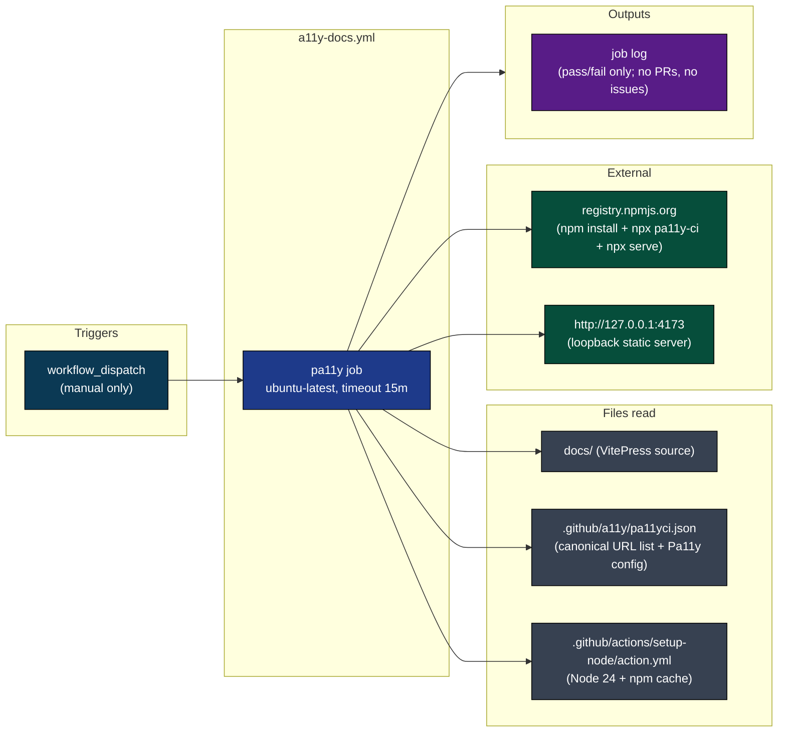
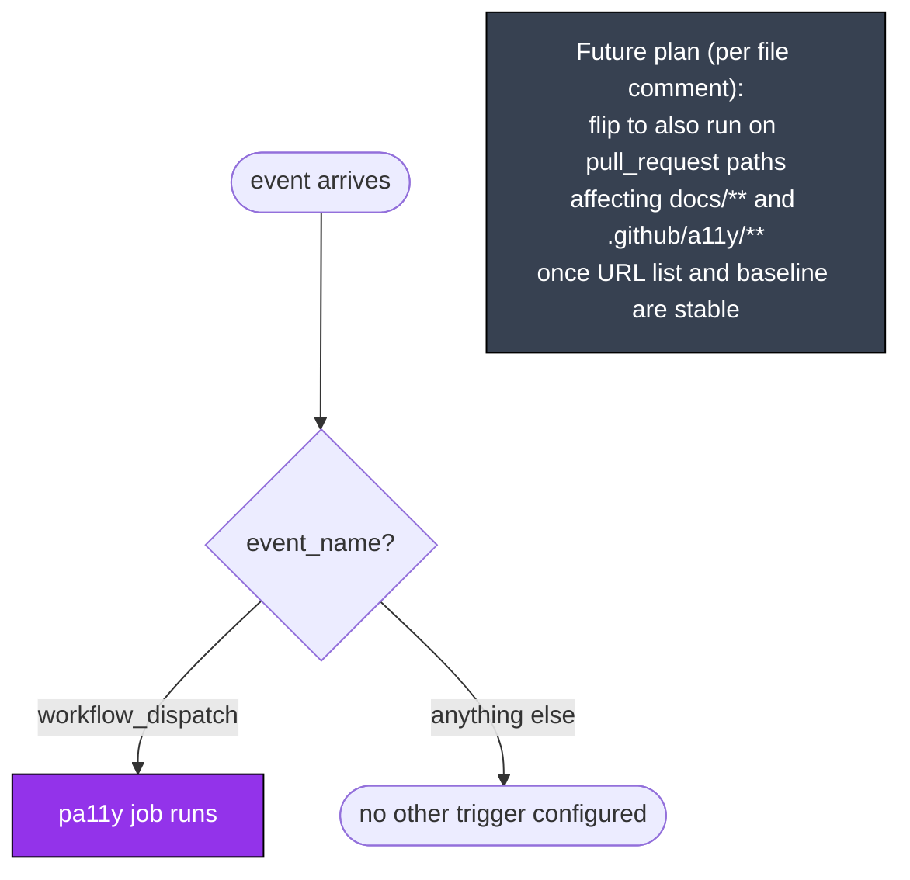
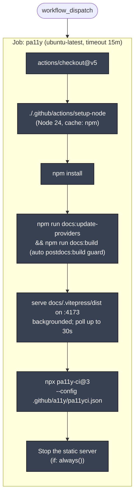
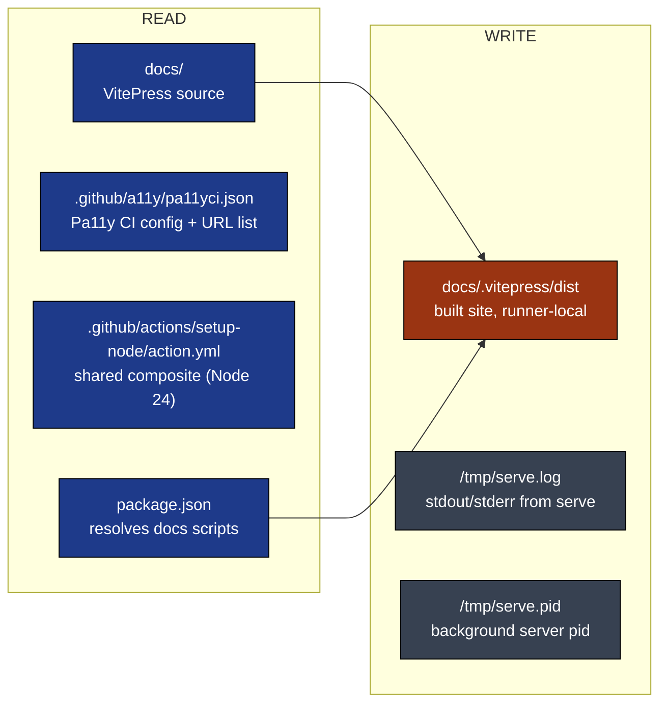
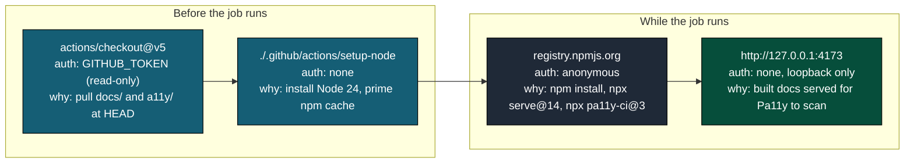
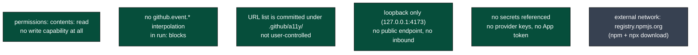
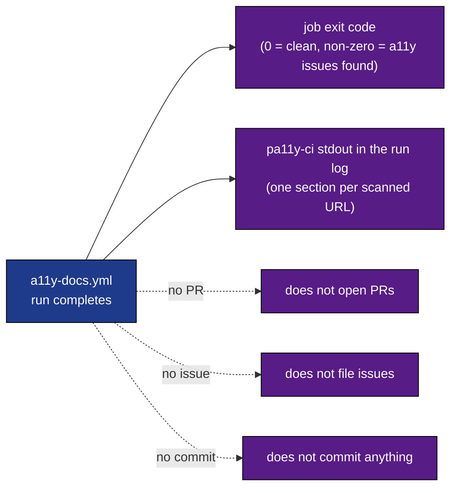
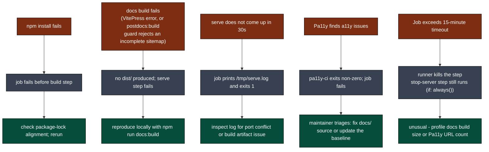
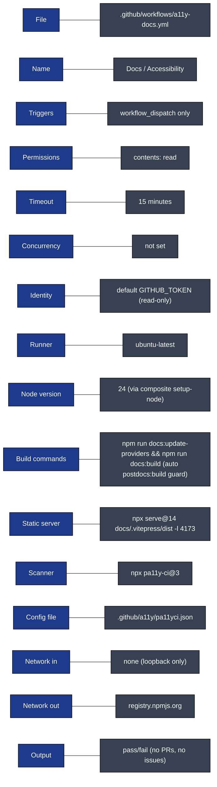

# A11y Docs: Visual Deep Dive

Concentrated diagrams for [.github/workflows/a11y-docs.yml](../workflows/a11y-docs.yml). Companion to [WORKFLOW_ARCHITECTURE.md](WORKFLOW_ARCHITECTURE.md).

Minimum prose. Maximum diagrams.

## Navigate

- [1. The whole picture](#1-the-whole-picture)
- [2. Triggers](#2-triggers)
- [3. The single-job DAG](#3-the-single-job-dag)
- [4. Step-by-step lifecycle](#4-step-by-step-lifecycle)
- [5. Filesystem reads and writes](#5-filesystem-reads-and-writes)
- [6. External calls](#6-external-calls)
- [7. Security posture](#7-security-posture)
- [8. Output](#8-output)
- [9. Failure modes](#9-failure-modes)
- [10. Quick reference card](#10-quick-reference-card)

---

## 1. The whole picture

How [a11y-docs.yml](../workflows/a11y-docs.yml) plugs into everything (or rather, does not).



Standalone workflow. It does not write to GitHub, does not commit, does not open PRs, does not fire any other workflow. Pass/fail is the entire output.

[Back to top](#navigate)

---

## 2. Triggers

One entry point, by design.



The workflow file's comments document the intent: manual-only for now to let the canonical URL list and the Pa11y baseline stabilize. Once those are settled, add a `pull_request` trigger filtered to `docs/**` and `.github/a11y/**`.

Source: [.github/workflows/a11y-docs.yml](../workflows/a11y-docs.yml) lines 12-15.

[Back to top](#navigate)

---

## 3. The single-job DAG

One job, six steps, no fan-out.



No concurrency group is configured. Two concurrent dispatches would run side by side. Since the job binds to a fixed local port inside its own runner, that is fine.

[Back to top](#navigate)

---

## 4. Step-by-step lifecycle

One run from dispatch to exit.

```mermaid
sequenceDiagram
    autonumber
    participant E as Event
    participant J as pa11y job
    participant G as Git
    participant N as Node + npm
    participant V as VitePress build
    participant S as npx serve@14 (loopback :4173)
    participant P as npx pa11y-ci@3
    participant CFG as .github/a11y/pa11yci.json

    E->>J: workflow_dispatch
    J->>G: checkout@v5 (default token, read-only)
    J->>N: setup-node@v6 via composite (node 24, cache npm)
    J->>N: npm install
    J->>V: npm run docs:update-providers + npm run docs:build
    V->>V: postdocs:build guard (verify-docs-build.mjs checks sitemap)
    V-->>J: docs/.vitepress/dist
    J->>S: spawn serve@14 dist -l 4173 (background)
    Note over J,S: poll http://127.0.0.1:4173/ for up to 30 seconds
    S-->>J: 200 OK
    J->>P: npx pa11y-ci@3 --config CFG
    P->>CFG: read URL list and Pa11y config
    P->>S: HTTP fetches against loopback
    P-->>J: accessibility report; exit code drives job outcome
    J->>S: kill pid in /tmp/serve.pid (if: always())
```

Source: [.github/workflows/a11y-docs.yml](../workflows/a11y-docs.yml) lines 20-60.

[Back to top](#navigate)

---

## 5. Filesystem reads and writes

Color: blue is read, orange is write. Why each one exists.



Nothing here is committed. Everything written is ephemeral runner state.

[Back to top](#navigate)

---

## 6. External calls

Who is contacted, with what credential, why.



No App token. No bot identity. No Anthropic call. No `gh` writes. The job is pure CI verification.

[Back to top](#navigate)

---

## 7. Security posture

Why this workflow has a tiny attack surface.



Source comment at the top of the workflow file explicitly calls this out: "this workflow does not consume any user-controlled `github.event.*` input inside `run:` blocks." Path filters are not yet enabled because the trigger is manual-only.

[Back to top](#navigate)

---

## 8. Output

What the run produces.



Pass/fail is the entire output. The maintainer reads the Actions tab to see which URLs failed Pa11y.

[Back to top](#navigate)

---

## 9. Failure modes

Where things break, what happens.



[Back to top](#navigate)

---

## 10. Quick reference card



Direct links:

- Workflow file: [.github/workflows/a11y-docs.yml](../workflows/a11y-docs.yml)
- Pa11y config: [.github/a11y/pa11yci.json](../a11y/pa11yci.json)
- Composite action: [setup-node](../actions/setup-node/action.yml)
- Full architecture doc: [WORKFLOW_ARCHITECTURE.md](WORKFLOW_ARCHITECTURE.md)

[Back to top](#navigate)
